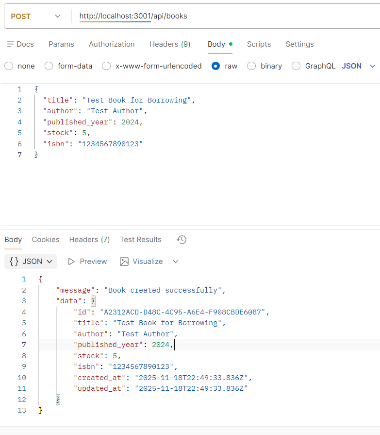
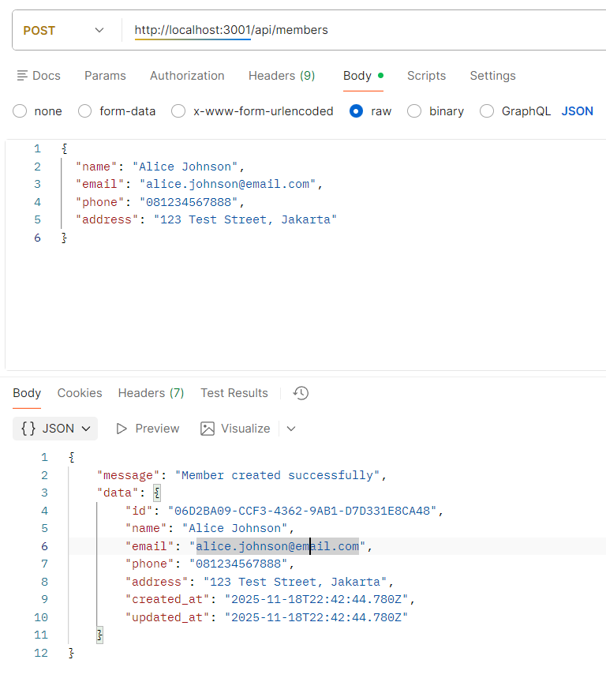
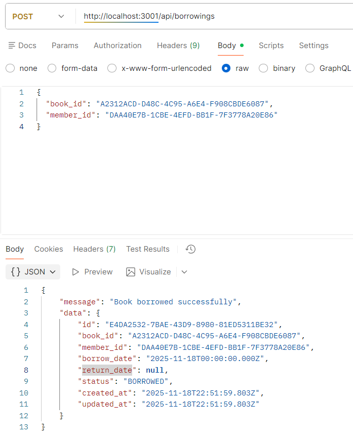

# 📚 Library Management System API (LMS-API)

RESTful API untuk sistem manajemen perpustakaan, dibangun menggunakan **Express.js** sebagai kerangka kerja backend dan **SQL Server** sebagai sistem manajemen database.

---

Hasil Pengujian
https://documenter.getpostman.com/view/25518059/2sB3WwrxSh

## ✨ Fitur Utama

Aplikasi ini menyediakan manajemen lengkap untuk buku, anggota, dan transaksi peminjaman, diiringi dengan penegakan aturan bisnis yang ketat.

- **Manajemen Buku**:
  - List buku dengan fitur **filtering** (berdasarkan judul/penulis) dan **pagination**.
  - Detail, penambahan, dan pembaruan data buku.
- **Manajemen Member**:
  - Pendaftaran member baru dengan **validasi** (email unik dan format yang valid).
  - Detail member dan riwayat peminjaman.
- **Sistem Peminjaman**:
  - Pencatatan peminjaman dan pengembalian buku.
  - Mekanisme **transaksi database** untuk menjaga konsistensi data stok dan status pinjaman.
- **Aturan Bisnis (Business Rules)**:
  - **Batas Peminjaman**: Maksimal **3 buku** per member.
  - **Validasi Stok**: Peminjaman hanya dapat dilakukan jika stok buku > 0.
  - **Stok Otomatis**: Stok buku otomatis berkurang saat dipinjam dan bertambah saat dikembalikan.
- **Penanganan Error**: Implementasi penanganan error yang komprehensif untuk skenario seperti stok habis, batas pinjaman terlampaui, dan data tidak ditemukan.

---

## 🚀 Instalasi & Setup

Ikuti langkah-langkah berikut untuk menjalankan aplikasi secara lokal.

### Prerequisites

Pastikan Anda telah menginstal:

- **Node.js** (v14 atau higher)
- **SQL Server**
- **npm** atau **yarn**

### 1. Clone Repository

```bash
git clone [https://github.com/TambunanMagdalena/Junior-Backend.git](https://github.com/TambunanMagdalena/Junior-Backend.git)
cd Junior-Backend

2. Install Dependencies
npm install


3. Database Setup
A. Buat Database
Buat database baru di SQL Server:
CREATE DATABASE library_management;
GO
USE library_management;
GO

B. Jalankan Schema
Buat tabel-tabel yang diperlukan:

4. Environment Configuration
Buat file bernama .env di root direktori dan isi dengan detail koneksi database Anda:
PORT=
DB_HOST=
DB_PORT=
DB_USER=
DB_PASSWORD=
DB_NAME=

5. Start Server
Jalankan server:
# Mode Pengembangan (dengan nodemon)
npm run dev

# Mode Produksi
npm start


🧪 Hasil Pengujian (Testing Results)
Sistem telah diuji secara komprehensif untuk memastikan fungsionalitas inti dan kepatuhan terhadap semua aturan bisnis.
✅ Fungsionalitas Inti
GET /: Root Endpoint

GET /api/books: List buku

POST /api/members: Pendaftaran member

POST /api/books: Pembuatan buku

POST /api/borrowings: Transaksi peminjaman

PUT /api/borrowings/:id/return: Transaksi pengembalian

Verifikasi pembaruan stok buku otomatis

✅ Aturan Bisnis

Batas Pinjaman: Berhasil mencegah member meminjam buku ke-4.

Validasi Stok: Berhasil mencegah peminjaman saat stok buku = 0, dan stok otomatis berkurang/bertambah.

Validasi Member: Email harus unique.

Keamanan Transaksi: Database transactions menjamin konsistensi data (rollback otomatis jika gagal).

✅ Penanganan Error
Penanganan kesalahan untuk:

Format UUID tidak valid.

Data tidak ditemukan (Buku/Member/Peminjaman).

Email sudah terdaftar.

Buku habis (Out of Stock).

Batas Peminjaman terlampaui.

Upaya pengembalian buku yang sudah dikembalikan.


📚 API Documentation
Base URL
http://localhost:3001

Endpoints
1. Books (/api/books)


2. Members (/api/members)


3. Borrowings (/api/borrowings)

```

👨‍💻 Author
Magdalena Pebrianty Tambunan
